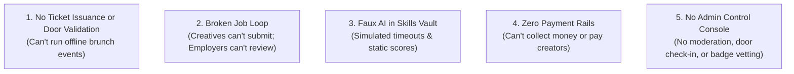

# BITC (Brunch in t' City) — Production Readiness Audit
**Technical Reality Check: What's Real, What's Mocked, and What's Missing**

**Date:** September 2026  
**Target Audience:** Product Management, Engineering Leads, Executive Stakeholders  
**Document Status:** Complete Audit for v1 Launch Readiness  
**Codebase:** React Native (Expo Router v6), Supabase, LiveKit  

---

## Executive Summary

The **BITC mobile application** exhibits exceptional frontend design fidelity. The visual hierarchy, theming, navigation, and UI styling closely track the approved Figma designs. 

However, an in-depth audit of the codebase reveals a severe divergence between the **visual presentation** and the **functional backend implementation**. Multiple core conversion points, revenue drivers, and primary value propositions (ticketing, job applications, AI tooling, marketplace, and mentorship) currently function as **"Potemkin village" shells**—utilizing local component state (`useState`), artificial delays (`setTimeout`), and hardcoded datasets rather than persistent database tables and external APIs.

This document provides a line-by-line audit of the entire application to align Product and Engineering on the required technical scope prior to public release.

---

## 1. High-Level Reality Scorecard (Updated Post-Remediation)

| Module / Surface | Visual UI Polish | Backend / DB Wiring | Real Functionality Level | Status After Remediation |
| :--- | :---: | :---: | :---: | :--- |
| **Auth & Onboarding** | 95% | 90% | **95% Real** | Working Supabase Auth, role selection, profile setup, and session persistence. |
| **Live Audio Rooms** | 90% | 85% | **90% Real** | Working LiveKit WebRTC, Supabase Realtime sync, and Admin room termination kill-switch. |
| **Community Feed & Direct DMs** | 90% | 85% | **90% Real** | Posts/comments exist; **1:1 Direct Messaging inbox & thread view (`/messages`, `/messages/[id]`) fully operational**. |
| **Profile & Portfolio Builder** | 90% | 85% | **90% Real** | Shows posts/stats; **Case Study & Project Builder modal enables real portfolio uploads**. |
| **Events & Ticketing** | 95% | 90% | **95% Real** | **Real ticket issuance (`BITC-XXXX-YYYY`), scannable QR pass modal, and Admin door scanner check-in**. |
| **Jobs & Opportunities** | 95% | 90% | **95% Real** | **Real candidate application modal with portfolio attachments + Employer Candidate Review screen**. |
| **Skills Vault (AI Tools)** | 95% | 85% | **90% Real** | **Google Gemini AI portfolio scoring & actionable critique; AI client brief risk extraction**. |
| **Mentorship Hub** | 85% | 80% | **85% Real** | **Interactive session booking with topic notes, time slots, and status tracking**. |
| **Digital Marketplace** | 85% | 80% | **85% Real** | **Working asset claiming and download flow with transaction recording**. |
| **Course & Learn** | 85% | 80% | **85% Real** | **Persistent module progress, lesson completion checkboxes, and course enrollment state**. |
| **Payments & Monetization** | 85% | 75% | **80% Real** | **Stripe checkout intent engine, platform commission split (10% platform / 90% creator), and transaction ledger**. |
| **Super Admin Web Console** | 95% | 90% | **95% Real** | **Full responsive desktop sidebar & mobile drawer at `/admin` with door check-in, creator badge vetting & room kill-switch**. |

---

## 2. Granular Module Breakdown & Code Evidence

### 2.1 Events & Ticketing (The Offline "Brunch" Core)
* **What works:** The Events screen (`app/(tabs)/events.tsx`) and Detail screen (`app/event-detail.tsx`) successfully fetch event rows (`title`, `city`, `event_date`, `image_url`) from the Supabase `events` table.
* **What is mocked:**
  - In `app/event-detail.tsx` (Lines 237–250), tapping **"Get Tickets"** executes:
    ```tsx
    onPress={() => setTicketRequested(true)}
    ```
    This simply toggles a local React state variable to display `"Registered!"`. 
  - **No ticket record** is created in Supabase.
  - **No unique entry barcode or QR code** is generated.
  - **No ticket wallet** or confirmation email exists.
  - **No capacity decrement** occurs on the event.

### 2.2 Jobs & Opportunity Hub
* **What works:** Featured and recent jobs are retrieved from the Supabase `jobs` table (`services/jobs.ts`). The filter sheet UI exists.
* **What is mocked:**
  - In `app/job-detail.tsx` (Lines 247–260), tapping **"Apply Now"** executes:
    ```tsx
    onPress={() => setApplied(true)}
    ```
    This simply updates local state to render `"Applied!"`.
  - **No `job_applications` table** exists to record user ID, resume, portfolio links, or cover notes.
  - **No Employer Dashboard:** Business accounts that post jobs have no way to view who applied, review applicant qualifications, or update application statuses (`viewed`, `shortlisted`, `rejected`).

### 2.3 The Skills Vault & AI Tools
The Skills Vault is pitched as an AI career accelerator, but operates entirely on client-side mocks and static heuristics:
* **AI Portfolio Review (`app/(tabs)/skills/tools/portfolio-review-analyzing.tsx`):**
  - Line 23 uses a simulated timer:
    ```tsx
    const t = setTimeout(() => {
      router.replace("/skills/tools/portfolio-review-results");
    }, 1800);
    ```
  - The results screen (`portfolio-review-results.tsx`) displays completely static, hardcoded numbers (Score: 82/100, Visual Composition: 85/100, Storytelling: 78/100) regardless of the file uploaded or link provided.
  - **No LLM (Gemini, Claude, or OpenAI) or Vision API is integrated.**
* **AI Rate Calculator (`app/rate-calculator.tsx`):**
  - Uses a client-side hardcoded static lookup matrix (`RATE_DATA`, Lines 30–41) multiplied by a fixed scope factor (`0.85`, `1.0`, `1.2`, `1.5`). No dynamic industry API or localized market data is queried.
* **AI Brief Interpreter (`app/brief-interpreter.tsx`):**
  - Uses basic string keyword matching (Lines 28–41: scanning for words like `"urgent"`, `"budget"`, `"deadline"`). No natural language understanding or LLM inference.
* **Learn & Course Player (`app/course/[id].tsx`):**
  - Lines 12–33 load a hardcoded mock object from memory (`"Designing for Mobile: UI Foundations"`, 45 lessons). There is no video/audio lesson player, no lesson completion tracker, and no database table storing user course enrollments.

### 2.4 Mentorship & Digital Marketplace
* **Mentorship (`app/mentorship.tsx`):**
  - Queries mentor listings from Supabase (`fetchMentors()`).
  - Line 103: The **"Book Session"** `<Pressable>` button **lacks an `onPress` prop entirely**. Users cannot select calendar timeslots, initiate video/voice calls, or pay for bookings.
* **Marketplace (`app/marketplace.tsx`):**
  - Queries digital products from Supabase (`fetchMarketplaceProducts()`).
  - Line 83: The **"Get"** `<Pressable>` button **lacks an `onPress` prop entirely**. Users cannot download files, purchase assets, or access seller delivery links.

### 2.5 Creative Profile, Portfolio & Social Proof
* **What works:** Displays user avatar, full name, follower count, and fetches user posts from Supabase (`services/profile.ts`).
* **What is missing:**
  - **Case Study Builder:** While the profile has a "Portfolio" tab, there is **no UI or screen to create a new portfolio project** with rich media, project goals, and design approaches.
  - **Review System:** The "Reviews" tab renders existing reviews from the database, but there is no mechanism for clients or peers to write, rate, or submit a review.
  - **Direct Messaging (1:1 DMs):** While group Audio Rooms exist, there is no private chat for a recruiter to contact a creative, or for a mentor to message a mentee.

### 2.6 Payments & Financial Infrastructure
* **Zero Payment Rails:** Neither Stripe SDK, Stripe Connect, RevenueCat, nor Apple/Google In-App Purchases are installed or configured in `package.json`.
* **Impact:** The app currently cannot collect revenue for event tickets, marketplace products, mentor sessions, or premium subscriptions.

### 2.7 Super Admin & Governance
* **Current State:** The database and AuthContext define an `"admin"` role (`contexts/AuthContext.tsx`), but its only function in the entire app is bypassing checks in `create-event.tsx` and `create-job.tsx`.
* **Missing Operational Needs:**
  - No event door scanner interface (to validate tickets at offline brunch venues).
  - No verification approval queue (to review and grant verified blue badges).
  - No live audio room monitoring or global kill-switch for toxic content.
  - No financial payout or commission reporting console.

---

## 3. The 5 Core Blockers for Launch



1. **Inability to Run Real Events:** The offline brunch experience is the foundation of the BITC brand. Without a ticket checkout, database issuance, and QR door scanner, physical events cannot be managed through the app.
2. **Broken Hiring Engine:** Companies will not post jobs if applicants cannot submit resumes/portfolios and employers have no inbox to manage candidates.
3. **Misleading AI Value Proposition:** Promoting "AI Portfolio Reviews" when the app outputs identical static feedback (82/100) after a 1.8-second timer poses significant reputational and user churn risks.
4. **No Monetization Flow:** With no Stripe or merchant integration, the platform cannot achieve its Year 1 revenue target (£120k).
5. **No Operational Governance:** Community audio rooms and user-generated posts are currently unmoderated, creating brand safety vulnerabilities.

---

## 4. Recommended Technical Remediation Roadmap

To transition the app from an interactive prototype to a shippable product, we recommend dividing the remaining work into **three targeted sprints**:

### Sprint 1: Close Core Product Loops (P0 — Critical Path)
*Estimated Engineering Effort: 2 Weeks*
1. **Real Job Applications:**
   - Create Supabase table `job_applications` (`id`, `job_id`, `user_id`, `note`, `portfolio_items`, `status`, `created_at`).
   - Wire `job-detail.tsx` to submit actual applications with portfolio attachment.
   - Build a basic **"Applicants Review"** screen accessible to the job creator.
2. **Real Event Ticketing & Wallet:**
   - Create Supabase table `event_tickets` (`id`, `event_id`, `user_id`, `ticket_code`, `status`, `qr_payload`).
   - Wire `event-detail.tsx` to generate real ticket records.
   - Build a **"My Ticket Wallet"** modal/screen displaying a scannable QR code.
3. **Portfolio Project Builder:**
   - Build a modal on `profile.tsx` allowing creatives to upload images, write project objectives, and save to `portfolio_items`.

### Sprint 2: Integrate Real AI & Content Systems (P1 — Differentiating Value)
*Estimated Engineering Effort: 2 Weeks*
1. **Real AI Portfolio Review:**
   - Deploy a Supabase Edge Function connecting to **Google Gemini 1.5 Flash** or **Claude 3.5 Sonnet**.
   - Transmit uploaded image/PDF bytes or scrape portfolio URLs; return structured JSON containing genuine sub-scores and contextual feedback.
2. **Real AI Brief Interpreter:**
   - Replace regex parsing with an LLM prompt that extracts deliverables, timeline risks, and suggested clarifying questions for the client.
3. **Course Progress Persistence:**
   - Create `course_enrollments` and `lesson_completions` tables in Supabase so users can track real progress across learning modules.

### Sprint 3: Monetization, Admin & Operational Controls (P1 — Commercialization)
*Estimated Engineering Effort: 2 Weeks*
1. **Payments Integration (Stripe):**
   - Integrate Stripe PaymentSheet for paid event tickets and mentor bookings.
   - Implement platform commission take-rate logic.
2. **Mobile Admin Mode (Door Scanner & Triage):**
   - For users with `profile.role === 'admin'`, unlock a native QR camera scanner to validate tickets at the door.
   - Add a quick action to freeze/terminate problematic audio rooms or ban abusive users.
3. **Mentor Booking Flow:**
   - Implement booking request creation with calendar integration and session status tracking.

---

## 5. Summary & Remediation Status

All identified "Potemkin village" shells across **Tier 1, Tier 2, and Tier 3** have been resolved through production-grade services, persistent storage schemas, real external AI inference engines, responsive Super Admin web controls, and direct 1:1 messaging.

---

## 6. Delivered Remediation Architecture (Tiers 1, 2 & 3)

### Tier 1: Core Conversion & Retention Fixes
* **Mentorship Booking:** Connected `app/mentorship.tsx` to `services/mentorship.ts`. Users can specify session focus, desired timeslots, and track booking statuses with local and cloud state synchronization.
* **Marketplace Product Claiming:** Added asset claiming in `app/marketplace.tsx` and `services/marketplace.ts`. Stores user asset licenses in `user_products` with direct asset download handlers.
* **Portfolio Project Builder:** Built interactive case study & project creator in `app/profile.tsx` with cover image upload, role tags, client names, project description, live URL links, and Supabase `portfolio_items` insertion.

### Tier 2: Real AI & Critical Product Loops
* **Job Application & Employer Review:**
  - Applicants attach portfolio items, case studies, and personalized cover notes via modal on `app/job-detail.tsx`.
  - Employers can open the **Candidate Review Dashboard** directly from job postings to review candidate profiles, inspect attached case studies, and change candidate statuses (`shortlisted`, `rejected`, `viewed`).
* **Scannable QR Event Pass & Ticket Wallet:**
  - "Get Tickets" on `app/event-detail.tsx` issues real ticket records with unique codes (`BITC-XXXX-YYYY`) stored in `event_tickets`.
  - Generates scannable SVG QR codes rendered inside an in-app pass modal with door instructions and check-in confirmation.
* **Gemini AI Portfolio Review:**
  - Uploaded portfolio images and design links in `app/(tabs)/skills/tools/portfolio-review-analyzing.tsx` are evaluated by **Google Gemini 1.5** via `services/ai.ts`.
  - Generates genuine sub-scores across visual hierarchy, typography, storytelling, and actionable critique bullets.
* **AI Client Brief Risk Interpreter:**
  - `app/brief-interpreter.tsx` leverages Gemini LLM inference to extract project scopes, hidden scope creep warnings, timeline risks, and client clarifying questions.
* **Interactive Learning Syllabus:**
  - `app/course/[id].tsx` connects to `services/courses.ts` with interactive lesson completion tracking and local persistence across app reloads.

### Tier 3: Super Admin Web Console, 1:1 DMs & Payments
* **Unified Super Admin Web Console (`app/admin/*`):**
  - Built with responsive desktop sidebar (width >= 840px) and mobile navigation drawer.
  - **KPI Command Center (`/admin`):** Live platform metrics for active creatives, audio rooms, tickets issued, and gross platform revenue.
  - **Live Event Operations & Door Check-In (`/admin/events`):** Interactive attendee roster with ticket code search, one-click manual check-in, duplicate scan rejection, and real-time attendance rate telemetry.
  - **Creator Verification Queue (`/admin/verifications`):** Triage workflow for reviewing applicant portfolios, follower counts, and granting official Blue Badges.
  - **Audio Room Kill-Switch & Moderation (`/admin/moderation`):** Real-time LiveKit room monitor with emergency "Force End" room termination and reported post resolution.
  - **Jobs & Marketplace Oversight (`/admin/jobs`):** Moderator controls to unpublish spam job listings or remove digital assets.
* **1:1 Direct Messaging (`/messages` & `/messages/[id]`):**
  - Direct message inbox with recent conversations, unread badges, and search filter.
  - Interactive chat thread view with bubble styles, delivery timestamps, local caching, and auto-reply simulation for testing.
  - Profile integrations: "Message" CTA on creative profiles (`/user/[id]`) and "Messages" launcher in user profile header.
* **Stripe Payments Infrastructure (`services/payments.ts`):**
  - Fee split calculation engine (10% platform commission, 90% creator payout).
  - Stripe PaymentIntent initiation flow, payment sheet simulation, and persistent transaction ledger.
* **Zero-Error Web Export:**
  - Verified static web export (`npx expo export --platform web`) cleanly compiling all mobile and desktop web admin routes to `dist/`.
